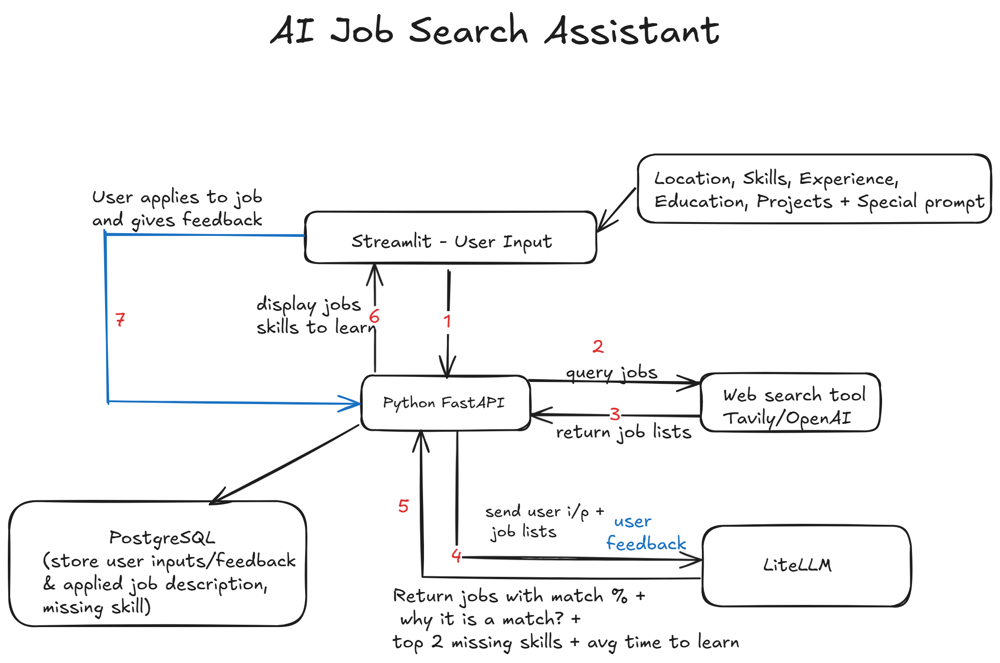

# ScoutifyAI - AI-Powered Personalized Job Search Agent


ScoutifyAI is an advanced AI-driven job search agent designed to revolutionize how you find career opportunities. By leveraging Large Language Models (LLMs) and vector search, ScoutifyAI provides hyper-personalized job recommendations, deep skill analysis, and actionable career insights tailored to your unique profile.

## Key Features

*   **Intelligent Resume Analysis:** ScoutifyAI extracts key technical skills and identifies the most suitable job titles from your uploaded resumes.
*   **Hyper-Personalized Search:** Fetches job listings from global APIs and filters them using sophisticated AI logic based on your specific roles, skills, and preferences.
*   **Semantic Matching:** Uses LLM-generated embeddings and Pinecone vector search to find jobs that truly match your profile beyond simple keywords.
*   **Deep Fit Analysis:** Provides comprehensive job-fit scores and identifies specific skill gaps between your profile and job requirements.
*   **Actionable Career Insights:** Aggregates skill gaps across searches to highlight high-impact areas for professional development.
*   **Interactive Dashboard:** A Streamlit-based UI for user interaction, managing jobs profiles, and viewing results.

## Tech Stack

*   **Backend:** Python, FastAPI (Asynchronous)
*   **Frontend:** Streamlit
*   **AI/ML:**
    *   OpenAI API (for LLM tasks like query generation, analysis, embeddings)
    *   Pinecone (Vector Database for semantic search)
*   **Database:** Supabase (PostgreSQL for user data, job details, search history)
*   **External Data:** RapidAPI (LinkedIn Job Search API)
*   **Containerization:** Docker

## Getting Started

Follow these steps to set up and run the application locally:

### 1. Prerequisites
- Python 3.8+
- [Pinecone Account](https://www.pinecone.io/)
- [Supabase Account](https://supabase.com/)
- [OpenAI API Key](https://platform.openai.com/)
- [RapidAPI Key](https://rapidapi.com/) (Subscription to "LinkedIn Job Search API" required)

### 2. Configuration
Copy the `.env.example` file to create your own `.env` file and fill in your API keys:
```bash
cp .env.example .env
```
> [!IMPORTANT]
> **Pinecone Setup:** Ensure you create a Pinecone index named `job-search-tool` with a namespace named `job-list`.

### 3. Database Setup (Supabase)
Run the [setup_supabase.sql](setup_supabase.sql) script in your Supabase SQL Editor to create the necessary tables and seed the default user.

### 4. Running with Docker Compose (Recommended)
You can run the entire stack with a single command:
```bash
docker compose up --build
```
This will start both services:
- Backend: `http://localhost:8000`
- Frontend: `http://localhost:8501`

## Usage (Overview)

1.  Open the Streamlit interface at `http://localhost:8501`.
2.  **Upload Resume:** Go to the Upload page to process your PDF resume.
3.  **Search Jobs:** Define job preferences (roles, skills, location). Support for voice input is available.
4.  **Analyze Results:** Review matched jobs, AI-generated match percentages, and skill gap insights.
5.  **Career Insights:** View aggregated trends from your searches to see where to focus your learning.
